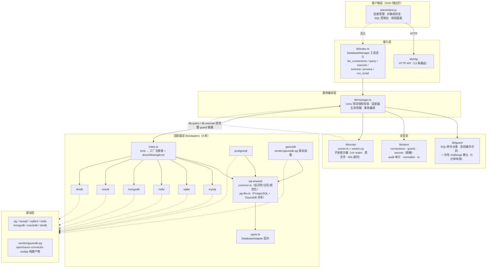
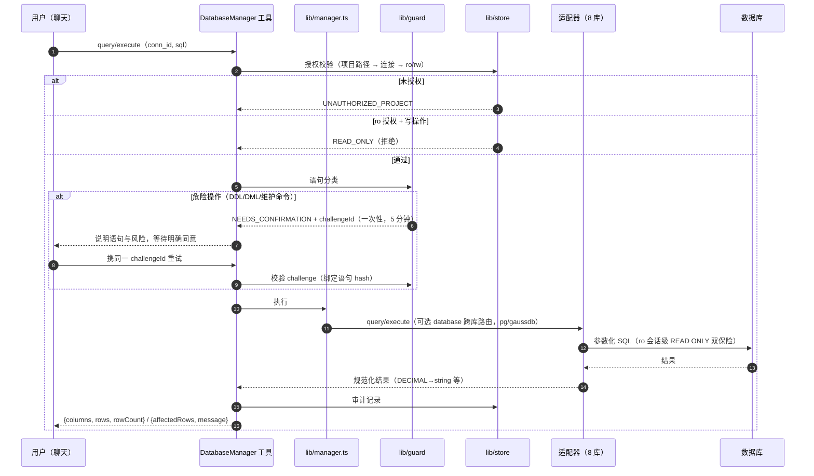
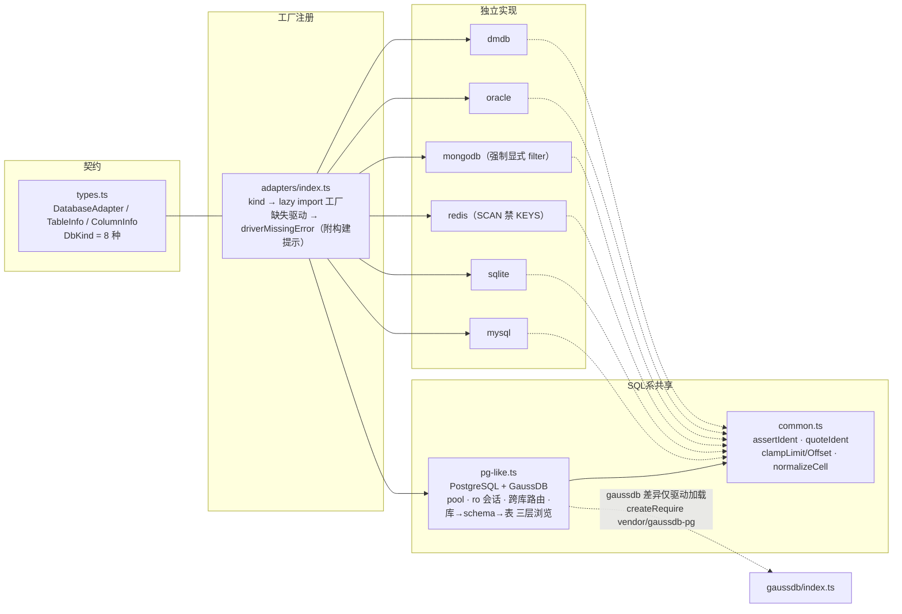
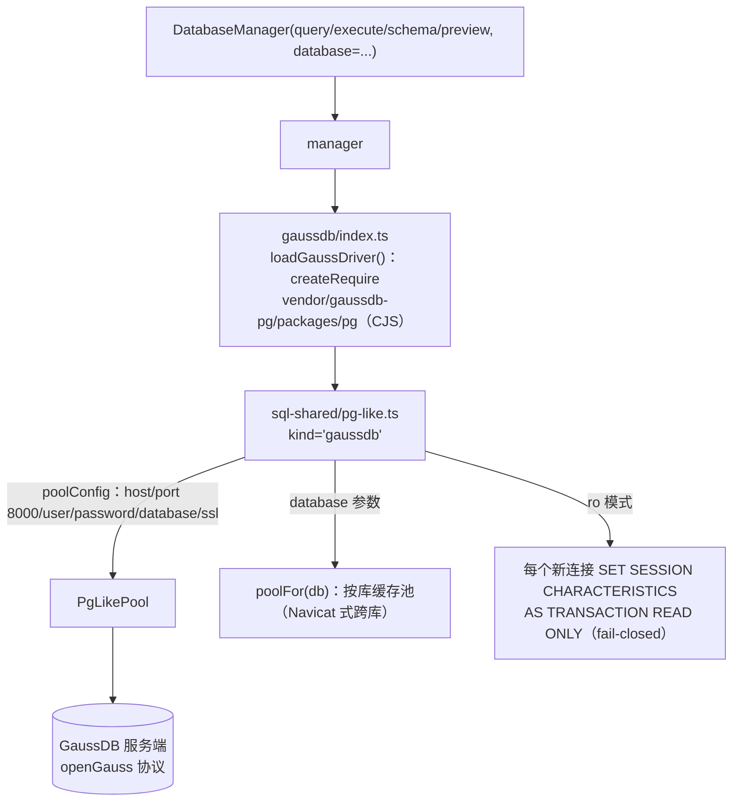

# dsh-db-tool 项目架构图

> 由 cbm（codebase-memory）索引数据绘制：843 节点 / 2702 边，模块分层见各图。
> 索引项目名：`E-Code-dsh-dsh-db-tool`。

## 1. 总体分层架构

## 2. 请求时序（query 与危险操作确认流）

## 3. 适配器体系（8 库 × 共享实现）

## 4. 模块分层职责（cbm layers 数据）

| 层 | 模块 | 特征 |
|---|---|---|
| entry | lib、script、e2e-mock | 仅出边（调用下游） |
| api | http | 含 13 条 HTTP 路由定义 |
| core | adapters（4 入 0 出）、store（12 入 0 出） | 高扇入核心，不依赖上层 |
| internal | manager（7 入 12 出）、tool、http | 编排枢纽 |
| leaf | guard | 仅入边，纯分类/判定 |

## 5. GaussDB 专项链路

- 驱动构建：`scripts/build-gaussdb.sh` / `.ps1` → 克隆 openGauss-connector-nodejs → `vendor/gaussdb-pg/packages/pg`（gitignore）。
- 测试：`tests/adapters-sql/gaussdb.test.ts`（驱动加载/工厂，mock 离线）+ `pg-like.test.ts`（pg/gaussdb 共享行为）。
